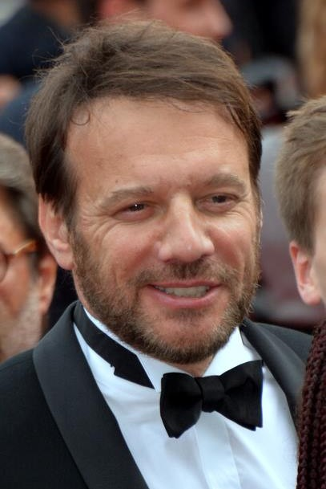

# Carpe Diem (série télévisée)

Carpe Diem est une série télévisée franco-belge réalisée par Pierre Isoard d'après un scénario de Julien Guérif et Pierre Isoard, et diffusée pour la première fois en Belgique à partir du 1er septembre 2024 sur La Une, en Suisse à partir du 25 février 2025 sur RTS Un et en France à partir du 10 mars 2025 sur TF1.
Cette fiction est une coproduction d'Escazal Films, Frelon Productions, TF1, Be-FILMS et la RTBF (télévision belge), réalisée avec la participation de la Radio télévision suisse (RTS) ainsi que le soutien de la région Provence-Alpes-Côte d'Azur, du département des Alpes-Maritimes et du Centre national du cinéma et de l'image animée,.

## Synopsis
Tom Villeneuve, 48 ans, vient d'être libéré après 17 ans passés en prison. Condamné à tort pour le meurtre de sa femme, il n'a qu'un but à présent : découvrir qui est son assassin.
Pendant toutes ses années en prison, il s'est accroché à des études de droit, qui l'autorisent à devenir avocat pénaliste. Il ouvre son cabinet à Nice et se spécialise dans la défense d'innocents injustement accusés.
Avec un style décontracté, il fait sienne la locution latine carpe diem : vivre le moment présent sans se soucier du lendemain.

## Distribution

### Personnages principaux
Samuel Le Bihan : Tom Villeneuve
Barbara Schulz : la capitaine Lucie Meunier
Maya Rose Binard : Zoé, la fille de Tom
Jisca Kalvanda : Sigourney, l'associée de Tom
Henri Giey : Simon, l'assistant de Tom et Sigourney
Mona Walravens : Anna de Santis, la femme de Tom morte il y a 17 ans
Féodor Atkine : Mauricio de Santis, le père d'Anna et le grand-père de Zoé
Cyril Lecomte : Peter Marks, le rival de Tom
Marc Andreoni : Joël Robinetti, dit Jojo, le directeur du palace Louxor

### Personnages secondaires récurrents
Antoine Gouy : Salvatore de Santis, le frère d'Anna
Julie Fournier : Rachel Segal, la marraine de Zoé
Luc Palun : Régis
Nicolas Grandhomme : Édouard Segal, le mari de Rachel
Pierre Samuel : juge Mendoza
Camille Damour : Nick, inspecteur de police
Michael Sisowath : Franco, inspecteur de police
Vincent Heneine : Marcus, patron de boîte de nuit
Elga Gnaly : Fatou, femme de chambre du palace Louxor

### Personnages non récurrents
Said Benchnafa : Blaz, trafiquant de drogue
Luna Lou : Justine Petrini, la voleuse du masque mortuaire de Napoléon
Matthieu Brion : Marc Balabane, le tueur à gages

## Production

### Genèse et développement
La série est créée et écrite par Julien Guérif et Pierre Isoard d'après une idée originale de Samuel Le Bihan, et réalisée par Pierre Isoard,.
Lors du Festival de la Fiction 2023, la productrice Sophie Révil évoque ce projet comme un mélange de comédie et de polar et précise qu'elle « n'a jamais vu une série avec un mélange de genre aussi assumé, avec une comédie très marquée. C'est un projet très original. ».

### Attribution des rôles
Le rôle principal est tenu par Samuel Le Bihan, « un changement de registre pour l'acteur qui quitte provisoirement le rôle titre d'Alex Hugo » pour interpréter « cet avocat atypique ».
L'acteur, résident de la région azuréenne depuis cinq ans, affiche son enthousiasme pour le projet : « C'était un peu un rêve de jouer dans le coin, entre la mer et la montagne, la Riviera… c'est un décor magnifique de carte postale, assez peu exploité au fond, avec une telle diversité de cultures, de classes sociales. J'avais envie d'un personnage un peu atypique, loufoque, qui vient de faire vingt ans de prison pour un meurtre qu'il n'a pas commis et qui, maintenant qu'il est dehors, décide de jouir de chaque instant, de profiter de la vie au maximum. Il est marqué par la souffrance et, en même temps, il est vraiment drôle ! On aimerait qu'il soit notre meilleur pote, parce qu'il est toujours plein de ressource, plein de propositions, séduisant par sa soif de renaissance et, surtout, de positivité ».

### Tournage
Le tournage de la série a lieu à partir du 10 octobre 2023 en région Provence-Alpes-Côte d'Azur,,, entre autres à Nice.

### Fiche technique
 Sauf indication contraire ou complémentaire, les informations mentionnées dans cette section peuvent être confirmées par les bases de données Allociné et IMDb.

Titre français : Carpe Diem
Genre : série judiciaire
Production : Sophie Révil et Denis Carot
Sociétés de production : Escazal Films, Frelon Productions, TF1, Be-FILMS et la RTBF
Réalisation : Pierre Isoard
Scénario : Julien Guérif et Pierre Isoard
Musique : Stéphane Moucha
Chorégraphie : Carlos Cruz - Compagnie Corps et Danse
Décors : Moundji Couture
Costumes :
Photographie : Bertrand Mouly
Son : Santiago paul
Montage : Éric Armbruster
Maquillage : Audrey Crepin et Laetitia Bille
Pays de production :  France /  Belgique
Langue originale : français
Format : couleur
Nombre de saisons : 1
Nombre d'épisodes : 6
Durée : 52 minutes
Dates de première diffusion :
Belgique : 1er septembre 2024 sur La Une,.
Suisse : 25 février 2025 sur RTS Un
France : 10 mars 2025 sur TF1
Générique : Sway, par Élodie Frégé.

## Accueil

### Audiences et diffusion

#### En Belgique
En Belgique, la série est diffusée le dimanche à 20 h 55 sur La Une par salve de deux épisodes du 1er au 15 septembre 2024,.

#### En France
En France, la série est diffusée le lundi à 21 h 10 sur TF1 par salve de deux épisodes du 10 au 24 mars 2025.

### Accueil critique
Noémie Jadoulle, de la RTBF, est conquise par ce qu'elle qualifie de dramédie ensoleillée : « Force tranquille dans la série Alex Hugo depuis dix ans, Samuel Le Bihan montre ici une autre facette de son jeu. Espiègle et moqueur, mais aussi sensible et blessé, son nouveau personnage dégage un capital sympathie immédiat. On a envie qu'il sauve le monde, mais surtout, qu'il n'oublie pas de se sauver lui-même. Car vivre au jour le jour c'est bien, mais s'assurer un bel avenir, c'est encore mieux ».
Télérama évoque « des personnages originaux » qui « font de cette fiction une jolie ode à la résilience, agréablement interprétée ».
Télépro souligne que « l'excellent Samuel Le Bihan incarne un avocat atypique dans ce thriller en six volets remarquablement ficelé ».
Alexandre Letren, du site VL-Media, est enthousiaste : « Carpe Diem est une série qui est réellement bien produite, bien écrite et parfaitement réalisée pour donner corps à un personnage attachant, profond et que Samuel Le Bihan incarne avec talent. Ce rôle tantôt totalement solaire, à la limite de l'innocence face aux plaisirs de la vie, tantôt sombre quand il a une mission à accomplir ».

## Notes et références

### Notes

### Références

## Liens externes

Ressources relatives à l'audiovisuel : Allociné IMDb  

 Portail des séries télévisées   Portail de la télévision française   Portail des années 2020