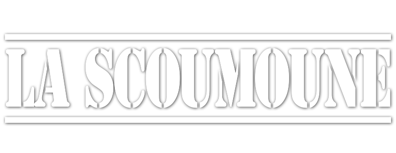

# La Scoumoune

La Scoumoune est un film franco-italien écrit et réalisé par José Giovanni, sorti en 1972. Il s'agit de l'adaptation de son roman L'Excommunié (Série noire 1958).

## Synopsis détaillé
Marseille, 1934. Xavier Saratov (Michel Constantin) est en prison pour un meurtre que Jeannot Villanova, le patron de la pègre marseillaise, lui a fait endosser en mettant un cadavre dans sa voiture. Georgia (Claudia Cardinale), sa sœur, et son ami Roberto Borgo (Jean-Paul Belmondo), surnommé « la Scoumoune » parce qu'il porte malheur à ses ennemis en dégainant et en tirant plus vite qu'eux, essayent de prouver son innocence.
Roberto élimine plusieurs tueurs de la pègre et finit même par abattre Villanova. Il reprend la gestion de son cabaret, dont il veut utiliser les bénéfices pour financer le procès de Xavier. Mais son ami, victime de son lourd casier judiciaire, est condamné à vingt ans de travaux forcés.
Roberto commence à échafauder un plan pour faire évader Xavier. C'est alors qu'entre en scène une bande de gangsters noirs américains, qui essaye de s'imposer avec brutalité dans le monde de la nuit marseillais. Au cours d'un affrontement, Roberto tue plusieurs d'entre eux, mais, blessé, finit par être arrêté. Il est condamné à son tour à vingt ans, et se retrouve dans la même prison que Xavier.
À la déclaration de guerre, les deux amis font une demande pour s'engager, mais la défaite prématurée de la France la rend caduque. Ils font quelques essais d'évasion, qui échouent.
À la Libération, l'État décrète des remises de peine aux détenus volontaires pour une mission périlleuse : contribuer au déminage de la côte Atlantique. Les deux amis, comme beaucoup d'autres, saisissent l'occasion. Mal équipés, peu instruits, traités avec mépris et haine par les techniciens, nombreux sont les détenus à sauter sur les mines. Roberto s'en sort indemne, mais Xavier perd son bras gauche.
Après leur libération, Roberto et Xavier se font d'abord engager pour « remettre de l'ordre » dans le monde de la nuit. Mais Xavier, gaucher donc très handicapé par la perte de son bras, n'arrive pas à se réintégrer à la vie civile. Roberto décide donc d'acquérir par la force le cabaret de ses employeurs, avec l'intention de le revendre pour s'installer à la campagne avec Xavier et sa sœur. Mais le milieu a bien changé : il regorge de nouvelles bandes sans scrupules, formées d'anciens maquisards. Un jour, alors que Roberto est absent, Xavier est tué et Georgia blessée dans un affrontement contre l'une d'entre elles. Roberto jure de les venger.

## Fiche technique
 Sauf indication contraire ou complémentaire, les informations mentionnées dans cette section peuvent être confirmées par la base de données d'Unifrance.

Titre original : La Scoumoune
Réalisation : José Giovanni
Assistant réalisateur : Philippe Lefebvre et Bernard Mazauric
Scénario : José Giovanni, d'après son roman L’Excommunié
Musique : François de Roubaix
Décors : Jean-Jacques Caziot
Costumes : Jacqueline Moreau
Photographie : Andréas Winding
Son : René-Christian Forget
Montage : Françoise Javet
Production : Raymond Danon et Ralph Baum
Sociétés de production : Lira Films (France) ; Praesidens (Italie)
Société de distribution : Fox-Lira
Pays de production :  France /  Italie
Langue originale : français
Format : couleur - 1.37:1
Genre : policier
Durée : 105 minutes
Date de sortie :
France : 12 décembre 1972
Affiche : René Ferracci (France)

## Distribution

## Autour du film
Lieux du tournage : la Corse ; le Fort de Bellegarde, qui est situé aux environs du Perthus dans les Pyrénées-Orientales. Voir aussi Cinéma dans les Pyrénées-Orientales.
Box-office : 1 975 895 entrées
Le roman de José Giovanni, L'excommunié, avait déjà été adapté au cinéma par Jean Becker en 1961 sous le titre Un nommé La Rocca (déjà avec Jean-Paul Belmondo dans le rôle de Roberto, ainsi que Michel Constantin mais dans celui d'un des truands américains). José Giovanni, n'étant pas satisfait du film bien qu'il en ait été le dialoguiste, a tourné ensuite sa propre adaptation, en reprenant Jean-Paul Belmondo dans le rôle principal.
Dans les deux films adaptés de L'excommunié, Dominique Zardi, « l'homme aux 600 films », joue à peu près le même rôle, celui d'un prisonnier démineur qui se fait tuer par une explosion sur la plage.
Dans le rôle de l'avocat, on retrouve Jean-Claude Michel, qui est surtout connu pour ses doublages. Il fut entre autres la voix de Sean Connery et de Clint Eastwood.
La musique du film est signée François de Roubaix. Le thème principal a longtemps servi de générique à l’émission Fréquence Mômes sur France Inter.

## Notes et références

## Liens externes

Ressources relatives à l'audiovisuel : AllMovie Allociné BFI National Archive Centre national du cinéma et de l'image animée Ciné-Ressources Cinémathèque québécoise Filmweb.pl IMDb LUMIERE Movie Review Query Engine OFDb Rotten Tomatoes The Movie Database Unifrance  

 Portail du cinéma français   Portail du cinéma italien   Portail des années 1970