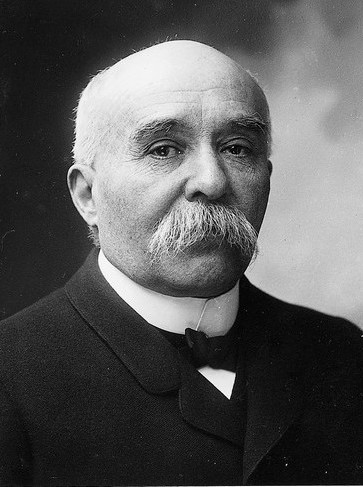

# Marie-Georges Picquart

Marie-Georges Picquart, né le 6 septembre 1854 à Strasbourg et mort le 19 janvier 1914 à Amiens, est un officier et homme politique français.
Acteur central de l'affaire Dreyfus, il découvre les preuves de la trahison de Ferdinand Walsin Esterhazy, à la place duquel le capitaine Dreyfus a été accusé, dégradé et condamné sur de fausses preuves, et participe au rétablissement de la vérité, malgré la pression de sa hiérarchie. Tout comme Dreyfus, Alsacien comme lui, il est arrêté bien qu'innocent, et incarcéré. Les deux hommes sont réintégrés en même temps, en 1906.
Il reprend ensuite le cours de sa carrière militaire jusqu'au grade de général de division (trois étoiles) et rejoint la même année le premier gouvernement Clemenceau en tant que ministre de la Guerre.
Il meurt en 1914 des suites d'un accident de cheval.

## Biographie

### Enfance et formation
Marie-Georges Picquart naît au 9, rue de la Nuée-Bleue à Strasbourg le 6 septembre 1854, de Marie Charles François Hubert Picquart, percepteur des contributions directes, et de Louise Henriette Mélanie Debenesse. De vieille souche lorraine, la famille Picquart professe un catholicisme ardent dont il se détachera plus tard, en se déclarant agnostique.
Il est le cinquième d'une famille de six enfants, Marie Anne et Joseph Hubert, nés en 1844, Marie Philomène Henriette, née en 1846 et morte en 1850, Pierre Paul, né en 1849, Louis René, né et mort en 1859[réf. nécessaire].
Son grand-père est directeur des manutentions militaires à Strasbourg.
En 1856, la famille s'installe à Geudertheim où son père vient d'être nommé percepteur des contributions directes. Ils demeurent plus de six ans au château du colonel de Weitersheim avant de revenir à Strasbourg. Il est élève boursier au lycée impérial de Strasbourg (actuel lycée Fustel-de-Coulanges) où il obtient en concurrence avec ses amis des prix en fin d'année (histoire-géographie…).
Son père meurt en 1865.
Après l'annexion de l'Alsace-Moselle en 1871, Louise Picquart opte pour la France dès début 1872, pour elle et ses enfants, et la famille quitte l'Alsace,.

### Orthographe du prénom
Son acte de naissance le prénomme « Marie George » (sans trait d'union ni s final). Marie est également le premier prénom de son père. Ce prénom épicène est parfois donné aux garçons comme prénom secondaire ou dans un prénom composé, comme Marie-Georges. La forme Georges est la plus répandue en français (George est la graphie usuelle en anglais).
Le prénom Marie-Georges est le plus souvent utilisé dans les documents officiels concernant Picquart (dont le Journal officiel du 17 juillet 1906 ou le compte-rendu des débats de la Cour de cassation ainsi que dans la plupart des sources et l'usage courant. Mais sont parfois employés, sans trait d'union, les deux prénoms de son état-civil Marie George (comme pour la Légion d'honneur), ou leur variante Marie Georges (encyclopédie Larousse).
Le prénom usuel dans la société du XIXe siècle et de la première moitié du XXe siècle était fréquemment − mais pas nécessairement − le dernier prénom de l'acte de naissance – par exemple Pierre Paul Henri Gaston Doumergue. Ainsi la tombe de Picquart comporte-t-elle seulement l'initiale de son second prénom, et sa notice Bibliothèque nationale de France (BNF) le seul prénom Georges.

### Carrière militaire

#### Parcours

En novembre 1872, Picquart intègre l'École spéciale militaire de Saint-Cyr, promotion du Shah, à la 184e place sur 320. Il en sort en cinquième position sur les 304 élèves de sa promotion, et passe sous-lieutenant au 20e régiment d’infanterie en 1874. Il entre ensuite à l'École d'application de l'état-major dont il sort à la deuxième place sur 25 élèves en 1875. Il est promu lieutenant un an plus tard. Il est alors affecté au 7e régiment de cuirassiers comme stagiaire puis au 4e régiment de zouaves en 1879, régiment avec lequel il sert en Algérie jusqu'en 1880. De retour en métropole, il sert dans l’infanterie, au 6e bataillon de chasseurs à pied puis la même année, est promu capitaine au 126e régiment d’infanterie, avec lequel il part en stage à l’état-major de la 34e division (1882-1883), puis à l’état-major du corps expéditionnaire du Tonkin (1885-1888), où il est remarqué par ses supérieurs pour ses qualités d'officier[réf. nécessaire].
À son retour en métropole, il est promu commandant et affecté en 1888 au 144e régiment d’infanterie, puis au 9e régiment d’infanterie.
En 1890, il devient professeur de topographie à l'École supérieure de guerre où il a comme élève Alfred Dreyfus (qui est de cinq ans son cadet). En 1893, il revient servir à l'état-major de l'armée.
Il est alors l'objet d'appréciations des plus élogieuses de la part de la hiérarchie militaire : « aimable et sympathique », intelligence « supérieure », éducation « parfaite » et culture « très étendue », jugement « très droit », moralité, conduite, tenue « parfaites », « hardi et bon cavalier », « grand et d'un beau physique…, ».

#### Grades
1874 : sous-lieutenant
1876 : lieutenant
1880 : capitaine
1888 : chef de bataillon
1896 : lieutenant-colonel
1898 : mis en réforme
1906 : réintégré et rétroactivement nommé général de brigade en date de 1903
1906 : général de division

### Culture et humanisme
Fils d'une musicienne, Picquart est un amoureux des arts et des lettres qui va au théâtre, au concert et aux expositions de peinture et fréquente les salons artistiques. En particulier, il fréquente le salon musical du frère de Georges Clemenceau, Paul Clemenceau, et de son épouse Sophie Szeps, fille d'un journaliste austro-hongrois influent. Le salon des Clemenceau est également fréquenté par Maurice Ravel, Paul Painlevé, Marya Freund, Alfredo Casella, la comtesse Greffulhe, Gustav Mahler, etc..
Il est également proche de Ferdinand Buisson, Gabriel Monod, Octave Mirbeau, Victor Basch, Louis Havet, Yves Guyot, Émile Duclaux, Michel Bréal, Paul Meyer, Édouard Grimaux, Alfred Croiset, Ludovic Trarieux, Pierre-Victor Stock et bien sûr Émile Zola.
Dans la mesure où il reste toute sa vie célibataire, la propagande anti-dreyfusarde suggèrera qu'il est homosexuel, un opprobre pouvant être passible des tribunaux à l'époque.
Intellectuel germaniste, il est passionné de littérature et de philosophie allemandes.
Après l'affaire Dreyfus, c'est chez son ami Gustav Mahler qu'il apprend en 1906 sa nomination comme ministre. Il devient membre de la Ligue des droits de l'homme créée en 1898. Il est abonné aux Cahiers de la Quinzaine, publication de réflexion philosophique, culturelle et humaniste dirigée par Charles Péguy.

### Affaire Dreyfus

#### Découverte du vrai coupable et condamnation

En 1895, Picquart est promu chef de la section de statistique (service de renseignement militaire) et au grade de lieutenant-colonel. Peu à peu convaincu de l'innocence du capitaine Alfred Dreyfus, il joue un rôle important dans l'affaire Dreyfus en relevant des indices accusant le commandant Ferdinand Walsin Esterhazy. Il découvre notamment un morceau de papier déchiré, connu sous le nom de « petit bleu », télégramme adressé par l'attaché militaire allemand à Esterhazy. Lorsqu'il consulte des lettres d'Esterhazy, il constate que c'est la même écriture que celle du bordereau, principal élément à charge contre Dreyfus, et en informe sa hiérarchie.
Aussitôt, les appréciations de ses supérieurs, jusque-là très élogieuses, changent radicalement. Le chef d'état-major général dit alors de lui : « j'estime qu'il peut y avoir des inconvénients graves à lui laisser la direction d'un service aussi important et qui exige (…) un jugement plus sain, plus calme et plus pondéré. »
Ses supérieurs choisissent alors de l'éloigner et le mutent  en janvier 1897 en Tunisie au 4e régiment de tirailleurs algériens. Craignant pour sa vie, Picquart décide de communiquer sa découverte à son ami et avocat Louis Leblois avec mission, si le danger devenait trop grand pour lui, d'en informer le pouvoir politique. Louis Leblois ne suit pas les recommandations de Picquart et révèle ce qu'il sait au sénateur alsacien Auguste Scheurer-Kestner, considéré comme une autorité morale de la République et qui décide de relancer l'Affaire. Picquart est traduit en 1898 devant un conseil d'enquête qui le réforme pour faute grave. Le 26 février 1898, une décision présidentielle entérine cette mesure disciplinaire.

Accusé d'avoir fabriqué la preuve contre Ferdinand Walsin Esterhazy, il est emprisonné, à la prison du Cherche-Midi, pendant près d'un an où Marcel Proust lui envoie un exemplaire dédicacé de son livre Les Plaisirs et les Jours. Les dreyfusards en font un héros, à l'instar d'Octave Mirbeau qui écrit dans la préface d'Hommage des artistes à Picquart (février 1899) : 
« Comme on avait condamné Dreyfus, coupable d’être innocent, il savait qu’on condamnerait Picquart, doublement coupable d’une double innocence : celle de Dreyfus et la sienne. »

Après le procès de Rennes, il se sépare bruyamment des Dreyfus, leur reprochant de se satisfaire de la grâce et de l'amnistie, reproche en grande partie fondé par son antisémitisme, ou comme le dit Mathieu Dreyfus parce que Picquart avait été « ressais[i] par [ses] préjugés et [ses] passions ».

#### Réintégration
Picquart est réintégré dans l'armée, avec rétroactivité, le même jour que Dreyfus (qui lui ne bénéficie pas de la rétroactivité), et se voit nommé général de brigade en 1906. Il commande alors la 10e division d'infanterie où il est secondé par le commandant Mordacq à l'état-major.
Il devient ministre de la Guerre trois mois plus tard, aux côtés de Stephen Pichon, ministre des Affaires étrangères, dans le premier gouvernement de Clemenceau (25 octobre 1906-23 juillet 1909).
À partir de février 1910, il succède au général Joffre à la tête du 2e corps d'armée d'Amiens.

### Mort et hommage posthume

Il meurt le 19 janvier 1914, quelques mois avant la Première Guerre mondiale, des suites d’une chute de cheval en Picardie (œdème à la face provoquant l’étouffement).
Le gouvernement envisage alors d'organiser des funérailles nationales pour lui rendre hommage eu égard à son rôle dans l'affaire Dreyfus et en sa qualité d'ancien ministre de la Guerre mais, conformément à ses dernières volontés, comme en témoigne son testament : « N'appartenant à aucune confession religieuse, je m'oppose absolument à ce qu'il soit célébré, à l'occasion de mes obsèques, aucune cérémonie d'un culte quelconque », ses obsèques sont privées et civiles et se déroulent sans fleurs ni couronnes ni discours. Elles ont lieu le 21 janvier à Amiens dans le cadre familial, puis ses cendres sont ramenées à Paris et déposées au cimetière du Père-Lachaise à l'occasion d'un hommage officiel national.
Le 23 septembre 1919, après le retour de la ville à la France, ses cendres sont transférées à Strasbourg et déposées avec les honneurs militaires au cimetière Saint-Urbain[réf. nécessaire].

## Décorations
 Commandeur de la Légion d'honneur (11 juillet 1912)
 Médaille commémorative de l'expédition du Tonkin
 Médaille coloniale avec agrafe « Algérie » en 1880
 Chevalier de l’ordre royal du Cambodge ( Cambodge) en 1888
 Chevalier de l’ordre du Dragon d’Annam (Annam) en 1888

## Odonymes en hommage à Marie-Georges Picquart
Rue du Général-Picquart à Strasbourg, ville où il est né.
Avenue Colonel Picquart à Bruxelles.
Place de la mairie de Geudertheim, rebaptisée place Marie-Georges-Picquart depuis le 13 juillet 2006, où il a passé une partie de son enfance.
Rue Georges-Picquart à Guéret dans le prolongement de la rue Alfred-Dreyfus, toutes deux inaugurées le 11 juin 2011.
Rue Georges-Picquart à Paris dans le 17e arrondissement. Nouvelle rue créée dans le nouveau quartier Saussure à côté de Pont Cardinet, elle a ouvert en juin 2014.

		
			
			
		
		
			
			
		

## Filmographie
L'affaire Dreyfus a fait l'objet de plusieurs films mettant en scène le colonel Picquart.

### Cinéma
1899 : L'Affaire Dreyfus de Georges Méliès.
1930 : L'Affaire Dreyfus, de Richard Oswald, interprété par Albert Bassermann
1931 : Dreyfus (en), de F.W. Kraemer et Milton Rosmer, interprété par Charles Carson
1937 : La Vie d'Émile Zola, de William Dieterle, interprété par Henry O'Neill
1958 : L'Affaire Dreyfus, de José Ferrer : interprété par Leo Genn
2019 : J'accuse, de Roman Polanski, adapté du roman D. de Robert Harris, film centré sur le personnage de Picquart : interprété par Jean Dujardin

### Télévision
1978 : Émile Zola ou la Conscience humaine, de Stellio Lorenzi : interprété par Pierre Vernier
1991 : Une affaire d'honneur, de Ken Russell : interprété par Richard Dreyfuss
1995 : L'Affaire Dreyfus, de Yves Boisset sur un scénario de Jorge Semprún d'après le livre L'Affaire de Jean-Denis Bredin, grand prix du scénario au festival de télévision de Monte-Carlo : interprété par Christian Brendel

## Notes et références

## Voir aussi

### Bibliographie
Francis de Pressensé, L'Affaire Dreyfus. Un héros. Le colonel Picquart, Paris, Stock, 1898, XV-385 p..
Alphonse Halter, « Marie Georges Picquart », dans Nouveau Dictionnaire de biographie alsacienne, vol. 30, p. 3014.
Philippe Oriol, L'Histoire de l'affaire Dreyfus : de 1894 à nos jours, vol. 1 et 2, Paris, Les Belles Lettres, 2014, 1489 p. (ISBN 978-2-251-44467-3).
Philippe Oriol, Le Faux Ami du capitaine Dreyfus : Picquart, l'Affaire et ses mythes, Paris, Grasset, 2019, 248 p. (ISBN 978-2-246-86004-4, présentation en ligne).
Christophe Prochasson, « Le colonel Georges Picquart, ou La vertu cachée », Mil neuf cent : Revue d'histoire intellectuelle, no 11 « Comment sont-ils devenus dreyfusards ou anti-dreyfusards ? »,‎ 1993, p. 15-20 (lire en ligne).
Marcel Thomas, L'Affaire sans Dreyfus, Paris, Fayard, 1961, 587 p. (présentation en ligne).
Christian Vigouroux, Georges Picquart, dreyfusard, proscrit, ministre : La Justice par l'exactitude, Paris, Dalloz, 2008, VII-529 p. (ISBN 978-2-247-08025-0, présentation en ligne). Réédité par Dalloz en 2019 sous le titre : Georges Picquart, la biographie,  (ISBN 9782247198160), récompensé par le Prix Seligmann contre le racisme.
Maurice Ravel, L'intégrale : Correspondance (1895-1937), écrits et entretiens : édition établie, présentée et annotée par Manuel Cornejo, Paris, Le Passeur Éditeur, 2018, 1769 p. (ISBN 978-2-36890-577-7 et 2-36890-577-4, BNF 45607052)
Olivier Claudon, « Picquart : un Strasbourgeois au cœur de l'affaire Dreyfus », DNA,‎ 1er janvier 2020, p. 40
Pierre Gervais & Pauline Peretz, « Le colonel Picquart, lanceur d'alerte ou objecteur ? », La Vie des idées,‎ 3 décembre 2019 (lire en ligne, consulté le 1er décembre 2020)

### Liens externes

Ressource relative aux beaux-arts : National Portrait Gallery 
Ressource relative à la vie publique : base Léonore  

Photographies du général Picquart
Site officiel de la mairie de Geudertheim.
Site de la Société internationale d'histoire de l'affaire Dreyfus

 Portail de la France au XIXe siècle   Portail de la politique française   Portail de Strasbourg   Portail de l’Armée française   Portail du droit français